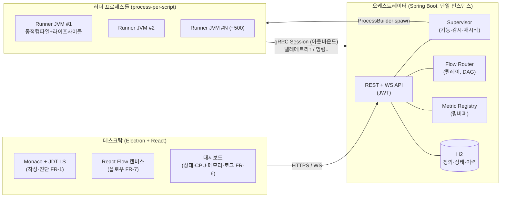
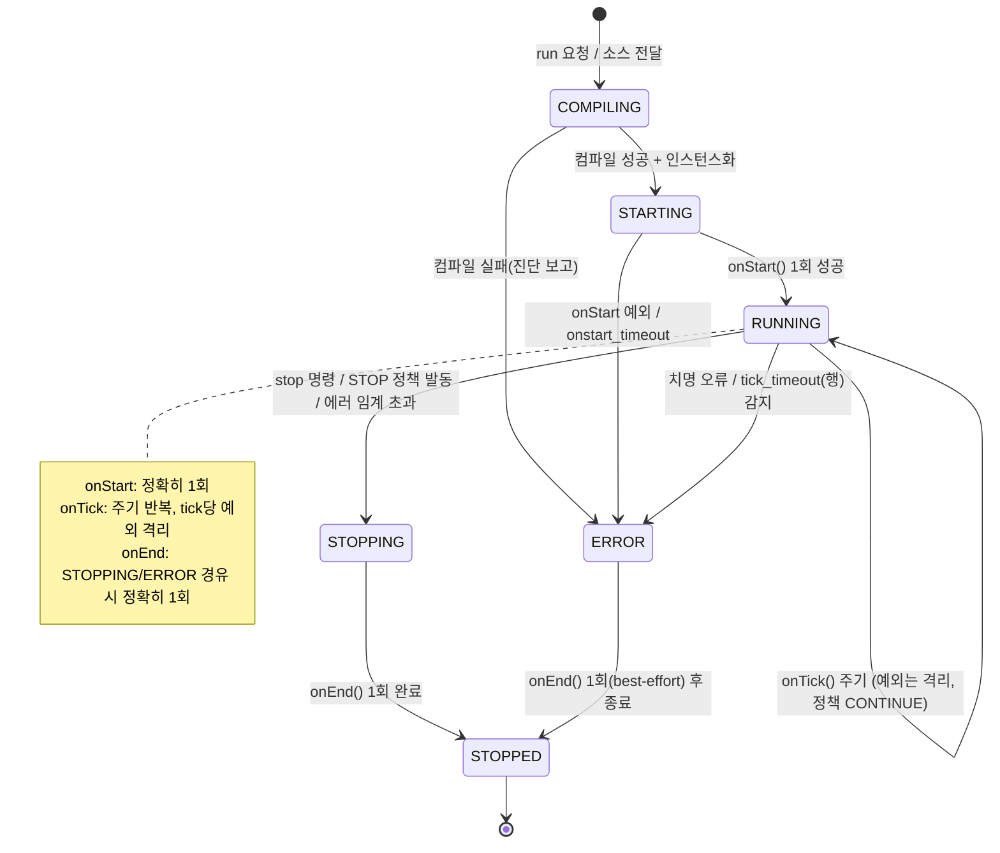
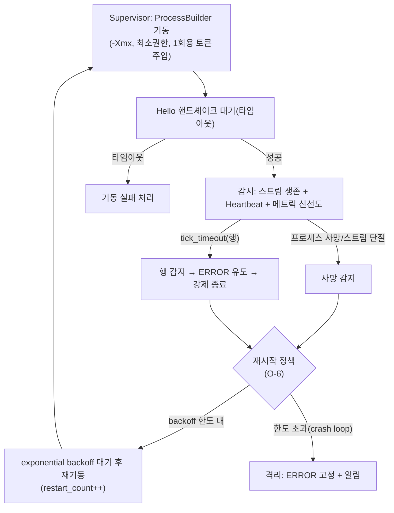
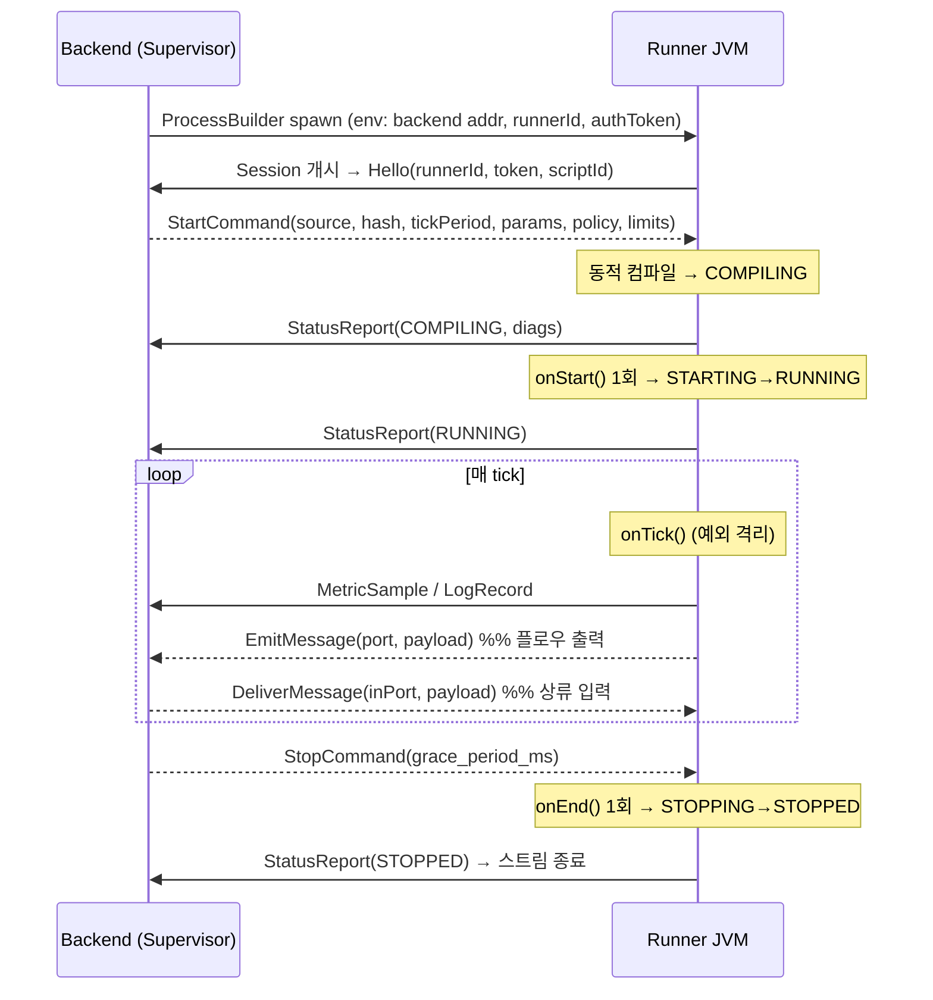
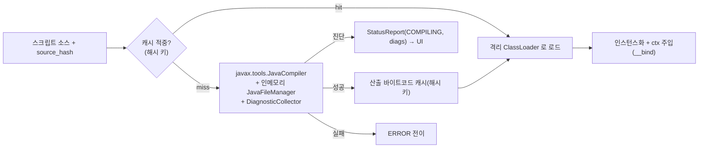
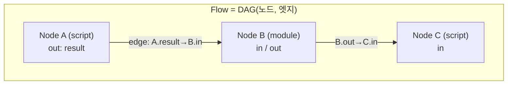

# Maestro — Phase 1 설계 (Architecture)

> 상태: **설계 작성 완료, 게이트 대기** · 작성일 2026-06-28
> 선행: [Phase 0 분석](00-analysis.md) · [ADR-0001](adr/0001-phase0-foundational-decisions.md) · [ADR-0002](adr/0002-design-decisions-ipc-flow-auth-storage.md)
> 동반 산출물: [`protocol/.../maestro.proto`](../protocol/src/main/proto/maestro.proto) · [`sdk` 스텁](../sdk/src/main/java/io/maestro/sdk) · [OpenAPI](api/openapi.yaml) · [DB 스키마](db/schema.sql)
> 다음: 승인 시 **Phase 2 — 스캐폴딩**(모노레포·Gradle·pnpm·CI)

---

## 1. 설계 목표 & 확정 전제

분석/ADR에서 확정한 전제 위에 설계한다.

- 규모: 동시 **100–500 러너** / 단일 서버급 호스트 (D1)
- 신뢰 모델: **신뢰된 사용자**, 경량 샌드박스 (D2)
- 저장소: **H2 서버모드** + Postgres 전환경로 / 메트릭 인메모리 링버퍼 (D3, O-1)
- 배포: **다중 사용자 + JWT 인증** (D4, O-8)
- 버스: **백엔드 릴레이** (D5)
- IPC: **gRPC** 단일 양방향 스트림 (O-2)
- 플로우: **DAG 강제** (O-9)

## 2. 시스템 컨텍스트

핵심: **러너는 백엔드로 아웃바운드 접속**(인바운드 포트 미할당) → 수백 프로세스 확장 용이.

## 3. 컴포넌트 / 모듈 매핑 (C-2 모노레포)

| 모듈 | 책임 | 핵심 의존 |
|---|---|---|
| `sdk` | 스크립트 베이스(`Script`)·`ScriptContext`·`Logger`·`KeyValueStore` (순수 자바 lib, 무겁지 않게) | 없음 |
| `protocol` | gRPC `.proto`(backend↔runner) — 공용 스키마 단일출처 | protobuf/gRPC |
| `runner` | 동적 컴파일(`JavaCompiler`)·`ClassLoader`·라이프사이클 스케줄러·tick 워치독·gRPC 클라이언트 | sdk, protocol |
| `backend` | Spring Boot: Supervisor·스케줄·REST/WS·인증·Flow Router·Metric Registry·H2 | protocol |
| `desktop` | Electron+React+Monaco+JDT LS·React Flow·대시보드 | (API 소비) |
| `deploy` | Docker(backend)·electron-builder·CI/CD | — |
| `docs` | 분석·설계·ADR·시뮬레이션 리포트 | — |

## 4. 라이프사이클 상태기계 (FR-3 — 시스템의 심장)

**보장 규칙**
- `onStart` 성공 후에만 `RUNNING` 진입 → tick 시작.
- 어떤 경로로 종료하든 `STOPPED` 전에 `onEnd`를 **정확히 1회** 호출(graceful). 단 `kill -9`/OOM/전원차단은 프로세스가 즉사하므로 **보장 불가(best-effort)** — DoD/위협모델 명시(R-2, T-4).
- `tick_timeout` 초과(행) → 워치독이 `ERROR` 전이 유도 → `onEnd` 시도 → 강제 종료(T-3).

## 5. 프로세스 감시 / 재시작 모델 (FR-5, NFR-4)

- **감시 신호 3종**: (1) gRPC 스트림 생존, (2) 주기 `Heartbeat`/메트릭 신선도, (3) OS 프로세스 alive(`Process.isAlive`).
- **재시작**: exponential backoff + 최대 횟수 → crash loop 방지(O-6). 정상 `STOPPED`(사용자 중지)는 재시작하지 않음.
- **OS 메트릭 보강**: 러너 자기보고(`OperatingSystemMXBean`) + 백엔드 OS레벨(OSHI)로 교차검증.
- **기동 스로틀링**: 동시 기동 폭주 방지 큐(수백 규모 D1) — 부팅 스톰 회피.

## 6. IPC 프로토콜 (gRPC, O-2)

스키마: [`protocol/src/main/proto/maestro.proto`](../protocol/src/main/proto/maestro.proto).
단일 RPC `RunnerGateway.Session(stream RunnerMessage) → (stream BackendMessage)`.

- **신뢰 경계(T-9)**: 백엔드 gRPC는 로컬 전용 바인딩, 러너는 기동 시 주입된 **1회용 토큰**으로 `Hello` 인증. 토큰 불일치 시 세션 거부.
- **상태 저장(O-6)**: `StateOp(GET/PUT/...)` ↔ `StateResult` 상관ID 매칭, 백엔드 H2 `script_state` 경유.

## 7. 동적 컴파일 파이프라인 (runner, FR-2)

- **인메모리 `JavaFileManager`** + `DiagnosticCollector`로 진단 수집 → 텔레메트리로 백엔드/UI 전달.
- **격리 `ClassLoader`**: 스크립트별 분리 → process-per-script가 메타스페이스 누수 자연 완화(T-10).
- **캐시 무효화**: `source_hash` 기반. 컴파일 타임아웃·소스 크기 한도(T-7).
- **SDK 클래스패스 제공**: 러너/JDT LS 모두 `sdk`를 클래스패스로 제공 → `onStart/onTick/onEnd`·`ScriptContext` 자동완성·진단(Phase 5).

## 8. 플로우 & 모듈 데이터 모델 (FR-7, FR-8 — DAG, O-9)

- **데이터 모델**: `Flow{ id, nodes[], edges[] }`. `Node{ id, kind(script|module), refId, params }`. `Edge{ fromNode, fromPort, toNode, toPort }`.
- **DAG 강제(O-9)**: 저장/배포 시 위상정렬로 **사이클 검출 → 거부(HTTP 422)**. 라우팅은 위상 순서 기반.
- **라우팅(릴레이, D5)**: 러너 `emit(port,msg)` → `EmitMessage` → 백엔드 `Flow Router`가 엣지 매핑으로 하류 노드 러너에 `DeliverMessage`.
- **백프레셔**: 노드별 **바운디드 큐** + 정책(block | drop-oldest). 하류 포화 시 상류 스로틀(NFR-4/5).
- **모듈(FR-8)**: `Module{ name, version(semver), spec(입출력 포트·파라미터 스키마), artifact }`. 인스턴스화 시 독립 러너 프로세스. H2 레지스트리(O-10).

## 9. 백엔드 API & 관측성

- **REST/WS**: 설계 스케치 [OpenAPI](api/openapi.yaml). 인증 `/api/auth/login`→JWT, 이후 Bearer. WS: `/ws/runs/{id}/logs|metrics`, `/ws/flows/{id}/events`.
- **메트릭(D3)**: 러너 `MetricSample`(heap·CPU·tick·error) → 백엔드 **인메모리 링버퍼**(프로세스당 최근 N분, 1–5초 해상도, O-7) → 대시보드 WS 푸시. DB 미저장.
- **로그**: 구조적 `LogRecord` 스트리밍 → WS 실시간 + 최근 버퍼.
- **헬스/관측(NFR-2)**: `/api/health`, 프로세스/플로우 메트릭, 구조적 로그.

## 10. 보안 설계 (NFR-3, D2 경량 + D4 다중사용자)

| 영역 | 설계 |
|---|---|
| 인증 | 로컬 계정(BCrypt) + JWT, Spring Security (O-8) |
| 인가 | 리소스 소유권 기반(스크립트/플로우/모듈/run 의 owner_id) — T-8 |
| 프로세스 격리 | OS 프로세스 경계, 크래시/OOM/행이 타 프로세스 무영향 (C-4) |
| 리소스 제한 | 러너당 `-Xmx`(max_heap), tick/onStart/onEnd 타임아웃, 에러 임계 (ResourceLimits) — T-1~T-3 |
| 최소 권한 | 러너는 비밀정보 비주입·최소 권한 환경 기동 (T-6) |
| IPC 신뢰경계 | 로컬 바인딩 + 1회용 핸드셰이크 토큰 (T-9) |
| 확장 훅 | 네트워크/파일 접근 정책 훅을 남김(현 신뢰모델선 미강제) — D2, 신뢰모델 변경 시 ADR 격상 |

## 11. 확정 ADR (이번 Phase)

- [ADR-0003](adr/0003-confirm-process-isolation-electron-jdt.md) — **프로세스 격리(process-per-script)·Electron 데스크탑·Eclipse JDT LS** 확정(근거·트레이드오프).

## 12. Phase 1 게이트 체크리스트

- [x] 시스템 컨텍스트·컴포넌트 아키텍처
- [x] 라이프사이클 상태기계(FR-3 보장 규칙)
- [x] 프로세스 감시/재시작 모델(O-6)
- [x] IPC 프로토콜 — `maestro.proto`(gRPC, O-2) + 시퀀스
- [x] 동적 컴파일 파이프라인
- [x] 플로우/모듈 데이터 모델(DAG, O-9) + 백프레셔
- [x] OpenAPI 스케치 + WS 채널
- [x] H2 DB 스키마(O-1, Flyway 전제)
- [x] 보안 설계(NFR-3)
- [x] `sdk` 인터페이스 스텁
- [x] ADR-0003(프로세스격리·Electron·JDT 확정)
- [ ] **사용자 승인(게이트)** → Phase 2 스캐폴딩 착수

### Phase 2(스캐폴딩) 미리보기
모노레포 + Gradle 멀티모듈(`sdk/runner/backend/protocol`) + pnpm(`desktop`) + protobuf 코드생성 배선 + 린트 + GitHub Actions CI 스켈레톤 + `CLAUDE.md`(빌드·실행·규칙). 완료기준: `./gradlew build`·`pnpm build` 통과.
